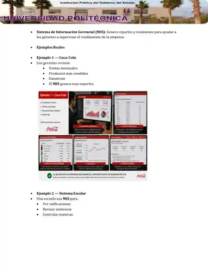
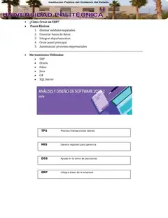

# Tipos de Sistemas de Información

## Información académica

**Universidad Politécnica de Baja California**  
**Asignatura:** Análisis y Diseño de Software  
**Catedrática:** Alicia del Refugio López Aguirre  
**Grupo:** 4AFM  
**Alumno:** Peyman Miyandashti  
**Matrícula:** 250161  
**Periodo:** 2026-2027

---

## Introducción

Los sistemas de información son herramientas tecnológicas utilizadas por las organizaciones para recopilar, procesar, almacenar y distribuir información. Estos sistemas ayudan a mejorar la comunicación, la organización y la toma de decisiones dentro de una empresa o institución.

## Importancia de los Sistemas de Información

Los sistemas de información ayudan a:

- Mejorar la productividad.
- Ahorrar tiempo.
- Reducir errores.
- Organizar datos.
- Tomar mejores decisiones.
- Mejorar la comunicación.

## ¿Qué son los Sistemas de Información?

Un sistema de información es un conjunto de elementos relacionados que trabajan juntos para obtener, procesar y compartir información útil. Estos sistemas permiten automatizar procesos y apoyar las actividades administrativas, operativas y estratégicas.

---

# 1. Sistema de Procesamiento de Transacciones (TPS)

Un **Sistema de Procesamiento de Transacciones (TPS)** se utiliza para registrar operaciones diarias como ventas, pagos, compras y movimientos bancarios.

## Ejemplos reales

### Walmart

Cuando una persona compra productos en Walmart, el sistema:

- Registra la venta.
- Actualiza el inventario.
- Genera el ticket automáticamente.

### Cajero Automático (ATM)

Cuando una persona retira dinero:

- El sistema verifica la cuenta.
- Descuenta el dinero.
- Actualiza el saldo.

### McDonald's

Cuando se realiza un pedido:

- El sistema manda la orden a cocina.
- Calcula el precio.
- Guarda la venta del día.

## ¿Cómo crear un TPS?

1. Crear una base de datos.
2. Crear formularios de entrada.
3. Registrar información automáticamente.
4. Guardar datos en el sistema.
5. Generar tickets o reportes.

### Herramientas utilizadas

- MySQL
- SQL Server
- Java
- C#
- Python
- Flutter
- PHP

---

# 2. Sistema de Información Gerencial (MIS)

Un **Sistema de Información Gerencial (MIS)** genera reportes y resúmenes para ayudar a los gerentes a supervisar el rendimiento de la empresa.

## Ejemplos reales

### Coca-Cola

Los gerentes pueden revisar:

- Ventas mensuales.
- Productos más vendidos.
- Ganancias.

### Sistema Escolar

Una escuela puede utilizar un MIS para:

- Ver calificaciones.
- Revisar asistencia.
- Controlar materias.

### Hospital

El director puede revisar:

- Número de pacientes.
- Medicamentos usados.
- Horarios médicos.

## ¿Cómo crear un MIS?

- Obtener información del TPS.
- Crear reportes automáticos.
- Diseñar paneles administrativos.
- Mostrar gráficas y estadísticas.

### Herramientas utilizadas

- Excel
- Power BI
- Tableau
- SQL
- Python
- Visual Studio

---

# 3. Sistema de Soporte a Decisiones (DSS)

Un **Sistema de Soporte a Decisiones (DSS)** ayuda a analizar información y tomar decisiones importantes mediante gráficos, estadísticas y simulaciones.

## Ejemplos reales

### Banco

El sistema analiza:

- Ingresos.
- Historial crediticio.
- Riesgo financiero.
- Posible aprobación de un préstamo.

### Hospital Inteligente

El DSS ayuda a los médicos a:

- Detectar enfermedades.
- Analizar síntomas.
- Recomendar tratamientos.

### Aerolíneas

El sistema analiza:

- Clima.
- Combustible.
- Rutas.
- Costos.
- Mejor ruta de vuelo.

## ¿Cómo crear un DSS?

- Recopilar muchos datos.
- Analizar información.
- Crear algoritmos.
- Generar predicciones.
- Mostrar recomendaciones.

### Herramientas utilizadas

- Python
- Machine Learning
- Inteligencia Artificial
- Big Data
- Power BI
- TensorFlow

---

# 4. Sistema ERP (Enterprise Resource Planning)

Un **ERP** integra diferentes áreas de la empresa como recursos humanos, finanzas, ventas y almacén.

## Ejemplos reales

### Toyota

Toyota utiliza un ERP para:

- Controlar piezas.
- Producción.
- Empleados.
- Ventas.

### Amazon

Amazon utiliza ERP para:

- Almacenes.
- Envíos.
- Inventario.
- Facturación.

### Hospital

El ERP puede controlar:

- Medicinas.
- Pacientes.
- Pagos.
- Recursos humanos.

## ¿Cómo crear un ERP?

1. Diseñar módulos separados.
2. Conectar bases de datos.
3. Integrar departamentos.
4. Crear un panel principal.
5. Automatizar procesos empresariales.

### Herramientas utilizadas

- SAP
- Oracle
- Odoo
- Java
- C#
- SQL Server

---

# Resumen

| Sistema | Función principal |
| --- | --- |
| TPS | Procesa transacciones diarias |
| MIS | Genera reportes para gerencia |
| DSS | Ayuda en la toma de decisiones |
| ERP | Integra áreas de la empresa |

---

# Conclusión

Los sistemas de información son fundamentales en el mundo actual porque permiten manejar grandes cantidades de datos y apoyar la toma de decisiones. Existen diferentes tipos de sistemas según las necesidades de cada organización, y todos contribuyen al crecimiento, organización y eficiencia empresarial.

> Las imágenes incluidas en este archivo corresponden al material visual del documento académico original.
