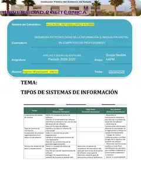

# Análisis y Diseño de Software

## Overview

This folder contains my academic work for the subject **Análisis y Diseño de Software** at the **Universidad Politécnica de Baja California (UPBC)**.

The material in this section documents concepts, assignments, examples, diagrams, and visual evidence related to software analysis and design.

## Academic Information

| Field | Information |
| --- | --- |
| University | Universidad Politécnica de Baja California |
| Program | Ingeniería en Tecnologías de la Información e Innovación Digital en Competencias Profesionales |
| Subject | Análisis y Diseño de Software |
| Professor | Alicia del Refugio López Aguirre |
| Group | Grupo flexible 4AFM |
| Student | Peyman Miyandashti |
| Student ID | 250161 |
| Academic Period | 2026-2027 |

## Current Work

| No. | Activity | Status |
| --- | --- | --- |
| 01 | [Tipos de Sistemas de Información](./01-Tipos-de-Sistemas-de-Informacion.md) | Completed |

## Repository Structure

```text
Analisis-y-Diseno-de-Software
│
├── assets
│   └── images
│       ├── page-01.webp
│       ├── page-03.webp
│       ├── page-04.webp
│       ├── page-05.webp
│       ├── page-06.webp
│       ├── page-07.webp
│       ├── page-08.webp
│       ├── page-09.webp
│       ├── page-10.webp
│       └── page-11.webp
│
├── 01-Tipos-de-Sistemas-de-Informacion.md
└── README.md
```

## Topics Covered

- Fundamentos de análisis de sistemas
- Tipos de sistemas de información
- Sistema de Procesamiento de Transacciones (TPS)
- Sistema de Información Gerencial (MIS)
- Sistema de Soporte a Decisiones (DSS)
- Sistema ERP (Enterprise Resource Planning)
- Herramientas de desarrollo y análisis
- Ejemplos reales de sistemas de información

## Source Material

The images in this folder were extracted directly from the original university PDF so the visual evidence remains consistent with the submitted academic document.
