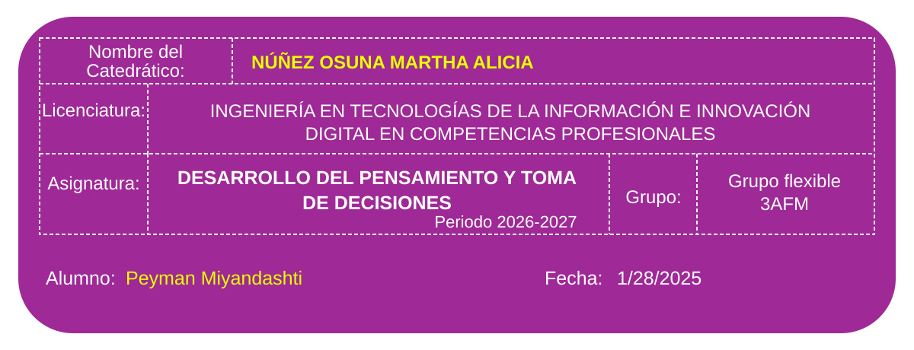

# Desarrollo del Pensamiento y Toma de Decisiones

## Overview

This folder contains my academic work for the subject **Desarrollo del Pensamiento y Toma de Decisiones** at the **Universidad Politécnica de Baja California (UPBC)**.

The purpose of this section is to keep assignments, analyses, project work, reports, presentations, and supporting material organized in one place throughout the course.

## Academic Information

| Field | Information |
| --- | --- |
| University | Universidad Politécnica de Baja California |
| Program | Ingeniería en Tecnologías de la Información e Innovación Digital en Competencias Profesionales |
| Subject | Desarrollo del Pensamiento y Toma de Decisiones |
| Professor | Núñez Osuna Martha Alicia |
| Group | Grupo flexible 3AFM |
| Student | Peyman Miyandashti |
| Academic Period | 2026–2027 |

## What I Will Learn

During this subject, I will document work related to:

- Problem identification and structured analysis.
- Critical and analytical thinking.
- Decision-making techniques.
- Root-cause analysis.
- Evaluation of probability and impact.
- Design and justification of technical solutions.
- Teamwork and professional communication.
- Integrative project development.

## Why It Matters

Decision-making is an essential skill in Information Technology because technical professionals must identify problems, evaluate alternatives, measure risks, justify solutions, and communicate recommendations clearly.

This subject connects analytical thinking with real engineering situations and supports the development of stronger professional judgment.

## Structure

```text
Desarrollo-del-Pensamiento-y-Toma-de-Decisiones
│
├── assets
│   └── course-info.svg
│
├── 01-Trabajo-en-Equipo-Proyecto-Integrador.md
│
└── README.md
```

## Current Work

| No. | Activity | Status |
| --- | --- | --- |
| 01 | [Trabajo en equipo – Proyecto integrador](./01-Trabajo-en-Equipo-Proyecto-Integrador.md) | Completed |

## Current Integrative Project Topic

**Falta de un sistema de registro de entrada y salida de estudiantes en la universidad**

The current activity analyzes the lack of a centralized digital access-record system for students and proposes a technical solution using technologies such as QR, NFC, web applications, databases, authentication, and administrative reporting.

## Skills Developed

- Critical thinking
- Root-cause analysis
- Technical problem solving
- Decision making
- Risk and impact evaluation
- Solution design
- Technical documentation
- Team collaboration
- Professional presentation

## Checklist

- [x] Create subject folder.
- [x] Add course information asset.
- [x] Create subject README.
- [x] Document the first integrative-project activity.
- [ ] Add future assignments.
- [ ] Add reports and presentations.
- [ ] Add supporting documents and evidence.
- [ ] Keep the subject portfolio updated throughout the course.

## Next Steps

Future homework, classroom activities, reports, presentations, diagrams, and project evidence for this subject will be added here as the course progresses.
