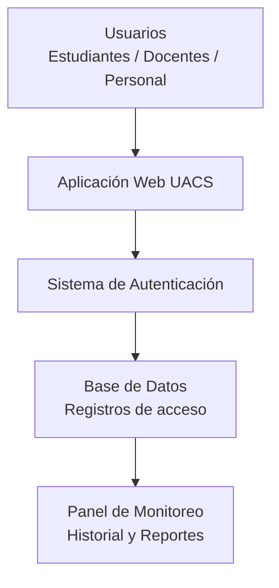

# Proyecto Integrador – Reporte II (Febrero)

## University Access Control System (UACS)

**Universidad Politécnica de Baja California**  
**Coordinación de Tecnologías**

### Proyecto

**Desarrollo e implementación del Sistema de Control de Acceso Universitario (UACS) en el área de seguridad de la Universidad Politécnica de Baja California.**

### Integrantes

1. Peyman Miyandashti
2. Brandon de Jesus Garza Jasso
3. Moises González Hernández
4. Luis Fernando Arellano Martínez

---

## 1. Resumen de actividades realizadas durante el mes

**Estado general:** En tiempo.

Durante el mes de febrero se continuó con el desarrollo del proyecto **University Access Control System (UACS)**, orientado a mejorar el control de acceso dentro de la Universidad Politécnica de Baja California.

Se avanzó en el diseño estructural del sistema web, incluyendo la planificación del módulo de autenticación de usuarios y el registro digital de entradas y salidas. También se trabajó en la definición de la base de datos que almacenará la información de estudiantes, docentes y personal administrativo.

Paralelamente, se diseñó la interfaz principal del sistema y se establecieron indicadores visuales de presencia para facilitar la supervisión del flujo de personas dentro del campus.

### Hitos alcanzados

Se completó la definición de la arquitectura conceptual del sistema UACS, incluyendo:

- Estructura del módulo de registro de accesos.
- Diseño preliminar de la interfaz de usuario.
- Planificación de la base de datos.
- Definición del historial de entradas y salidas.
- Indicadores visuales de presencia.

### Riesgos críticos

Los principales riesgos identificados son:

- Posible dificultad para integrar el sistema con las credenciales institucionales utilizadas por la universidad.
- Desafíos técnicos en la implementación de la base de datos.
- Validación de registros de acceso en tiempo real.
- Posibles errores en el registro o sincronización de información.

---

## 2. Avance de actividades – Resultados de febrero

### 2.1 Actividades completadas

Durante febrero se completaron las siguientes actividades:

- Análisis del problema actual relacionado con el registro manual de accesos dentro de la institución.
- Definición del objetivo principal del sistema de control de acceso universitario.
- Elaboración del diseño conceptual del sistema web para el monitoreo de accesos.
- Definición del modelo de usuario principal (*User Persona*).
- Desarrollo del primer wireframe con los módulos: Inicio, Historial, Reportes y Configuración.
- Definición de indicadores visuales de presencia:
  - Verde: persona dentro del campus.
  - Rojo: persona fuera del campus.

### 2.2 Actividades en proceso

Actualmente el equipo continúa trabajando en:

- Diseño detallado de la interfaz gráfica del sistema web.
- Desarrollo de la estructura de la base de datos.
- Implementación del módulo de autenticación con credenciales institucionales.
- Diseño del módulo de historial de entradas y salidas.
- Planificación del sistema de reportes para administración y seguridad.

### 2.3 Evidencia técnica

La evidencia técnica del proyecto incluye:

- Diagrama conceptual del sistema de control de accesos.
- Wireframe inicial de la interfaz principal.
- Estructura preliminar de la base de datos.
- Ejemplos de registros de entrada y salida.

#### Ejemplo de registro

| Usuario | Fecha | Hora de entrada | Hora de salida | Estado |
| --- | --- | --- | --- | --- |
| Alumno | 10/02/2026 | 08:05 | 13:50 | Fuera |
| Docente | 10/02/2026 | 07:45 | — | Dentro |

---

## 3. Cronograma de actividades

**Porcentaje de avance acumulado:** 35%

| Fase del proyecto | Progreso planificado | Progreso real | Desviación |
| --- | ---: | ---: | ---: |
| Investigación del problema | 100% | 100% | 0% |
| Diseño conceptual | 100% | 100% | 0% |
| Diseño del sistema | 70% | 60% | -10% |
| Desarrollo inicial | 40% | 30% | -10% |

El cronograma general del proyecto se mantiene dentro de los tiempos establecidos. Algunas fases presentan pequeñas variaciones debido al análisis técnico necesario para definir correctamente la estructura del sistema.

### Cronograma general

| Fase del proyecto | Enero | Febrero | Marzo | Abril |
| --- | :---: | :---: | :---: | :---: |
| Investigación del problema | X |  |  |  |
| Diseño conceptual | X | X |  |  |
| Diseño del sistema |  | X | X |  |
| Desarrollo del sistema |  |  | X | X |
| Pruebas y validación |  |  |  | X |

---

## 4. Gestión de recursos y costos

### 4.1 Materiales utilizados

- Computadoras personales para el desarrollo del sistema.
- Documentación institucional para el análisis del proceso de acceso.
- Credenciales universitarias utilizadas para pruebas del sistema.

### 4.2 Herramientas y software

- **Python** para el desarrollo del sistema.
- **SQLite** para la gestión y almacenamiento de datos.
- **Visual Studio Code** como entorno de desarrollo.
- Navegadores web para pruebas de interfaz y funcionamiento.

---

## 5. Obstáculos, impacto y acciones propuestas

| Obstáculo detectado | Impacto | Acción tomada / propuesta |
| --- | --- | --- |
| Falta de sistema digital para registrar accesos | Alto | Desarrollo de UACS para automatizar entradas y salidas |
| Registros manuales poco confiables | Medio | Implementación de una base de datos digital |
| Posibles errores en el registro de información | Medio | Validación de datos y visualización clara de los registros |

---

## 6. Planificación para marzo

Los principales objetivos para marzo son:

1. Desarrollar el prototipo funcional del sistema web de control de accesos.
2. Implementar la base de datos para registrar entradas y salidas de estudiantes, docentes y personal administrativo.
3. Diseñar e integrar completamente la interfaz de usuario.
4. Implementar los módulos de historial, reportes y configuración.
5. Continuar con la validación del flujo de autenticación y registro.

---

## 7. Arquitectura general del sistema



La arquitectura de UACS se compone de una interfaz web utilizada por el personal de seguridad, un sistema de autenticación que valida las credenciales institucionales, una base de datos que almacena los registros de acceso y un panel de monitoreo para consultar historial y reportes.

---

## 8. Wireframe de la interfaz principal

```text
+---------------------------------------------+
| LOGO UPBC                                   |
| Sistema de Control de Acceso                |
+---------------------------------------------+
| Personas dentro del campus                  |
|                                             |
| Nombre              | Hora de entrada       |
| Juan                | 08:05                 |
| Ana                 | 07:50                 |
|                                             |
|        [ Registrar Entrada / Salida ]       |
+---------------------------------------------+
| Inicio | Historial | Reportes | Config      |
+---------------------------------------------+
```

Este diseño representa la estructura inicial de la interfaz del sistema UACS, donde el personal de seguridad podrá visualizar en tiempo real la presencia de estudiantes y docentes dentro del campus, así como registrar manualmente entradas o salidas cuando sea necesario.

---

## 9. Modelo preliminar de base de datos

### Tabla: Usuarios

| Campo | Descripción |
| --- | --- |
| ID_usuario | Identificador único del usuario |
| Nombre | Nombre completo |
| Tipo_usuario | Estudiante, docente o personal |
| Correo | Correo institucional |
| Foto | Fotografía o referencia de imagen |

### Tabla: Registros

| Campo | Descripción |
| --- | --- |
| ID_registro | Identificador único del registro |
| ID_usuario | Relación con el usuario |
| Fecha | Fecha del acceso |
| Hora_entrada | Hora de ingreso |
| Hora_salida | Hora de salida |
| Estado | Dentro / Fuera |

### Ejemplo de datos

| ID Usuario | Nombre | Fecha | Hora entrada | Hora salida | Estado |
| ---: | --- | --- | --- | --- | --- |
| 1021 | Juan Pérez | 12/02/2026 | 08:02 | 14:05 | Fuera |
| 1045 | Ana López | 12/02/2026 | 07:55 | — | Dentro |

---

## 10. Conclusión

Durante febrero se consolidaron las bases conceptuales y técnicas del proyecto **University Access Control System (UACS)**. El equipo logró definir la arquitectura general, el diseño preliminar de la interfaz, la estructura inicial de la base de datos y el flujo principal de registro de accesos.

El proyecto mantiene un avance acumulado del **35%** y continúa dentro del cronograma general. Las siguientes etapas se enfocarán en convertir el diseño conceptual en un prototipo funcional, integrar los módulos principales y validar el funcionamiento del sistema en un contexto universitario.
